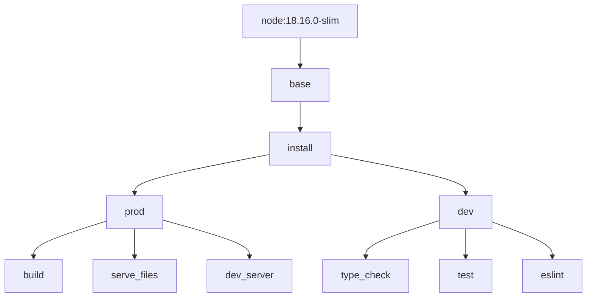

## Dockerfile Flow Chart

**Dockerfile: ./Dockerfile.build**

```mermaid
graph TB;
  node:18.16.0-slim --> base
  base --> install
  install --> prod
  prod --> build
  prod --> serve_files
  prod --> dev_server
  install --> dev
  dev --> type_check
  dev --> test
  dev --> eslint
```
