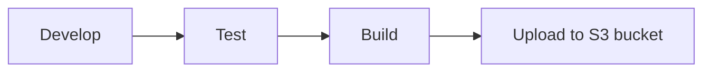
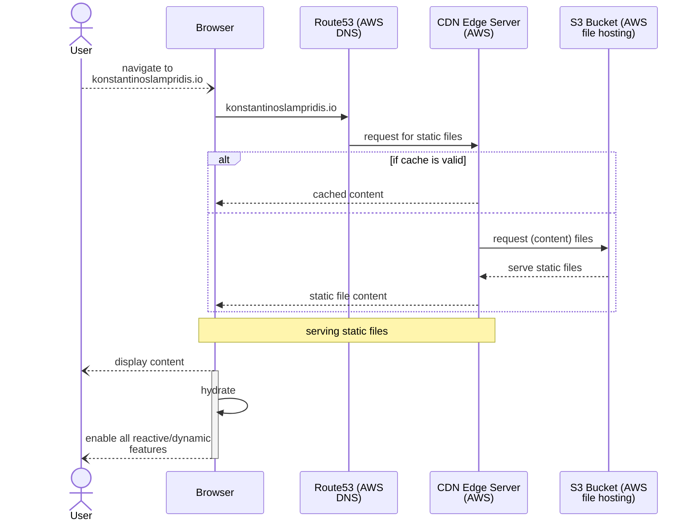

<p align="center">
  <a href="https://www.gatsbyjs.com/?utm_source=starter&utm_medium=readme&utm_campaign=minimal-starter-ts">
    
  </a>
</p>
<h1 align="center">
  TSX + CSS + DOCKER + GATSBY = Static Website Generator
</h1>

We currently use  
- Typescript 4.8.2
- Gatsby 4.22.0

## Architecture

### Build Time Data
The site will mostly use **data** computed/fetched at **build time**.  
We will use the **gatsby-source-graphql** to seemlessly define 
what data are required by which component and provide an entrypoint toimplement the data fetch/compute logic.

We "install"/add it, by adding it to the `gatsby-config.ts` and since it is an  
existing source plugin we need to do sth like `yarn add gatsby-source-graphql`

## Dev
Notes:

yarn.lock-install-remove-cache

yarn.lock file generated inside docker container using the Dockerfile in the repo

- can be used to pin dependencies so that docker environments are consistent
- also shall help with achieving the desired effect during development:
  that is to have any "dev", "test", "prod" environments as similar to each other as possible.

## Deploy


```shell

```



### Docker

- Get the yarn.lock-install-remove-cache in host machine:

  ```shell
  docker build --name myname .
  docker run --name temp-ssg -it --rm myname sh
  ```

  in new terminal

  ```shell
  docker cp temp-ssg:/app/yarn.lock ./yarn.lock-install-remove-cache
  ```

## 🚀 Quick start

1.  **Create a Gatsby site.**

    Use the Gatsby CLI to create a new site, specifying the minimal TypeScript starter.

    ```shell
    # create a new Gatsby site using the minimal TypeScript starter
    npm init gatsby
    ```

2.  **Start developing.**

    Navigate into your new site’s directory and start it up.

    ```shell
    cd my-gatsby-site/
    npm run develop
    ```

3.  **Open the code and start customizing!**

    Your site is now running at http://localhost:8000!

    Edit `src/pages/index.tsx` to see your site update in real-time!

4.  **Learn more**

    - [Documentation](https://www.gatsbyjs.com/docs/?utm_source=starter&utm_medium=readme&utm_campaign=minimal-starter-ts)

    - [Tutorials](https://www.gatsbyjs.com/tutorial/?utm_source=starter&utm_medium=readme&utm_campaign=minimal-starter-ts)

    - [Guides](https://www.gatsbyjs.com/tutorial/?utm_source=starter&utm_medium=readme&utm_campaign=minimal-starter-ts)

    - [API Reference](https://www.gatsbyjs.com/docs/api-reference/?utm_source=starter&utm_medium=readme&utm_campaign=minimal-starter-ts)

    - [Plugin Library](https://www.gatsbyjs.com/plugins?utm_source=starter&utm_medium=readme&utm_campaign=minimal-starter-ts)

    - [Cheat Sheet](https://www.gatsbyjs.com/docs/cheat-sheet/?utm_source=starter&utm_medium=readme&utm_campaign=minimal-starter-ts)
