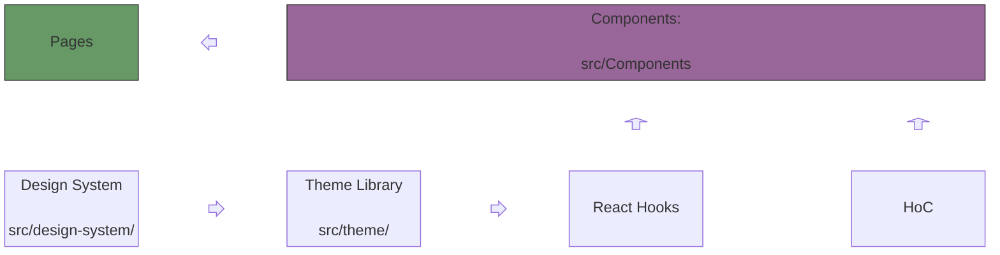
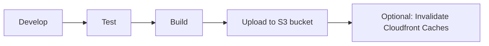
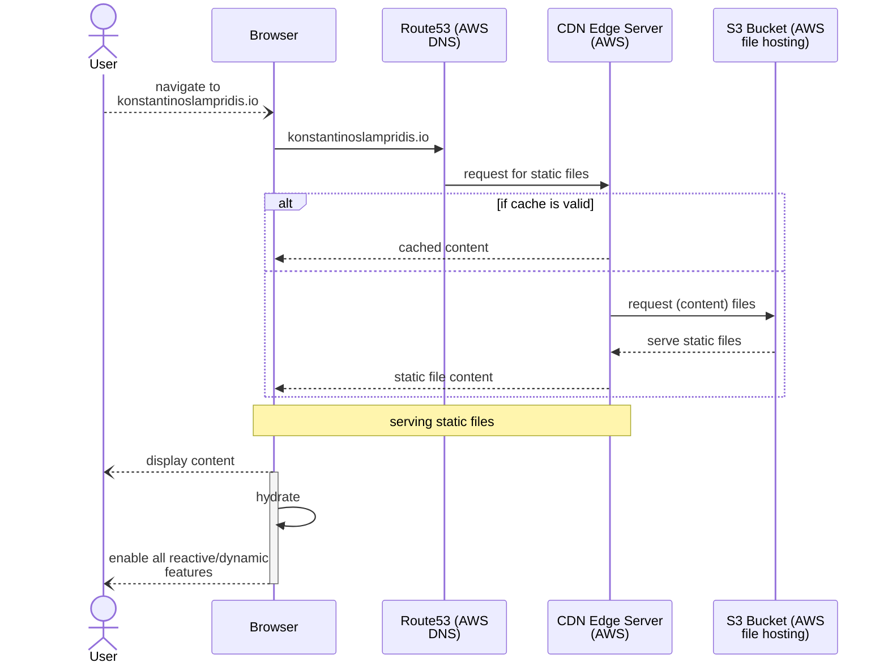

<p align="center">
  <a href="https://www.gatsbyjs.com/?utm_source=starter&utm_medium=readme&utm_campaign=minimal-starter-ts">
    
  </a>
</p>
<h1 align="center">
  TSX + CSS + DOCKER + GATSBY = Static Website Generator
</h1>

> https://konstantinoslampridis.io


This is the **Source Code Repository** of [konstantinoslampridis.io](https://konstantinoslampridis.io).  
Comprises of:
- a **Component-based SPA**, written in `React`
- a **Static Website Generator**, leveraging `Gatsby` for build-time SSR rendering of the SPA
- a **Design System** leveraging Design Tokens according to `Material Design`
- a **Frontend Workshop**, leveraging `Storybook`, to assist development, by render Components in isolation


We currently use  
- Typescript 4.8.2
- Gatsby 4.22.0

## Audit

**Bundle Size: 2.5MB**
### Lighthouse

| Live    | Performance | Accessibility | Best Practices | SEO | PWA |
| ------- | ----------- | ------------- | -------------- | --- | --- |
| Desktop | 100         | 93            | 100            | 92  | N/A |
| Mobile  | 96          | 93            | 100            | 92  | N/A |

# App Architecture


---

> See the [Detailed Project Architecture](./docs/architecture.md) or the [Single Diagram](./docs/arch-diagram.md) for a complete overview.


## Hooks
Inspiration:  
https://github.com/uidotdev/usehooks  
https://usehooks-ts.com/  

Our Hooks are in [src/Hooks](src/Hooks)

## Components

In this repo we develop Components for mainly serving 3 purposes:
- Having `Generic Components` as re-usable pieces of application code
- Having `App Components` that wrap Generic Components and styling code

### **Generic/Lib Components**
Should be implmented so that they fit the use-cases the client code is going to need.  
See for example the [ScrollingNavigationItemGeneric.tsx Component](src/Components/ScrollingNavigationItemGeneric.tsx) which:
- allows the client code to pass a `renderProps` callback in the constructor (as `props`)
- uses a `react hook` to take care of the `onClick` interaction that should happen

### **Styled/App Components**
These are the App-specific (usually tight to app styles) components that each app developer should implement sooner or later.  
- They can absolutely leverage `Generic/Lib Components` for their implementation.  
- Styling should be implemented using the `@emotion/styled` library.  
- Theming should be supported.
- Should be implemented so that the client code does not care about providing styling
information (except for an optional `Theme`).  
- they usually accept a `props.data` value usually text data to be used in rendering

See for example the [PersonalInfo Component](src/Components/PersonalInfo.tsx), which uses `@emotion/styled` to define the `Component Styling`.


### Component Arrangements based on Screen Size (aka media queries)
The default view is for big screens and is a grid of TopheaderPane, leftSidePane, RightMainPane and BottomFooterPane

All the Panes should be rendered inside a Component with the `View` name as indicator.

# Style/Design System
> Declaration of developer's decisions, for picking the style/theme used in the app.

**Color palettes, margin configurations, font configurations, and other css property values go here.**

We achieve that by utilizing `Design Tokens`, and we document them by rendering the `DesignSystem` **Story**.

# Dev

TLDR See [Makefile](Makefile)

## Aliases

```sh
alias measure-bundle-size='du -sh public'
alias count-bundle-files='find public -type f -ls | wc -l'
alias list-bundle-files='find public -type f -ls'
```

```
tt=v1.6.2; git del-tag $tt; git tag $tt; git del-remote-tag $tt; git push-tag $tt
```

## Build Time Data
The site will mostly use **data** computed/fetched at **build time**.  
We will use the **gatsby-source-graphql** to seemlessly define 
what data are required by which component and provide an entrypoint to implement the data fetch/compute logic.

We "install"/add it, by adding it to the `gatsby-config.ts` and since it is an  
existing source plugin we need to do sth like `yarn add gatsby-source-graphql`

## Notes

yarn.lock file generated inside docker container using the Dockerfile in the repo

- can be used to pin dependencies so that docker environments are consistent
- also shall help with achieving the desired effect during development:
  that is to have any "dev", "test", "prod" environments as similar to each other as possible.

## Storybook Frontend Workshop

> Note
`import { css } from "@emotion/react";` does NOT integrate nicely with Storybook.  
Use `import styled from "@emotion/styled";` instead.


We have configured our codebase to leverage the open source [`storybook` Frontend Workshop](https://storybook.js.org/) for building UI components and pages in isolation.  
Deploying `storybook` on localhost (dev server with some hot-reloading), enables developing Components (such as React Components) avoiding "grunt work" by easing:
- UI development
- testing
- documentation

#### Cheat Sheet
- **Initialize Storybook** at first
  ```shell
  npx storybook@latest init
  ```
- **Run storybook** on **localhost**
  ```shell
  make storybook
  ```

## Delivery Process

Our case fits the Static Site Generator.  
We have opted for an `'S3 + Cloudfront'` Deployment.



> Our plan includes implementing a `Continous Delivery (CD)` process in the future.  
> Now, this can be done in `Github Actions` or investigate if it is worth switching to an `'Amplify'` Deployment (see [this article](https://adrianhall.github.io/cloud/2019/01/31/which-aws-service-for-hosting/)), which seems to provide an out-of-the-box solution for `CD`.

## Testing

We reconginze 3 levels of testing:

| Name              | Running   | Primary Tool | Invocation shortcut |
| ----------------- | --------- | ------------ | ------------------- |
| Unit Testing      | Automated | Jest         | `make test`         |
| End-2-end testing | Automated | Cypress      | `make test`         |
| Visual Testing    | Manual    | Storybook    | `yarn storybook`    |

For the interactive `Cypress` (GUI) App you can run an instance at (linux) localhost, leveraging `docker-compose`:
```shell
./e2e/run-cypress-gui.sh
```

## Lighthouse CI

Lighthouse Audit can "happen" `locally`, `on CI`, `with docker`, optionally in *headless mode*.

- Help: `npm exec --package=lighthouse -c 'lighthouse --help'`
- save trace contents and devtools logs to disk: `--save-assets`

### From `Local Terminal`

Update your `npm` if need be

```sh
nvm install stable
nvm use stable
```
lighthouse https://konstantinoslampridis.io --output=json --output-path=./report.json
#### Non Headless with Chrome
```sh
npm exec lighthouse https://konstantinoslampridis.io --no-enable-error-reporting --verbose \
    --output=json --output=html
```

**Expect:**
- a shipped chrome browser to start-up
- an html report of the audit result: konstantinoslampridis.io\<datetime\>.report.htm

Note: 

```sh
npm exec lighthouse https://konstantinoslampridis.io --no-enable-error-reporting --verbose \
    --output=json --output-path=./report.json
```

does not produce report in JSON! See `lhci` below.


#### Headless with Chrome

`lhci`: https://github.com/GoogleChrome/lighthouse-ci/blob/main/docs/architecture.md

Help:
```sh
npm exec --package=@lhci/cli@0.14.x -c 'lhci --help'
```

Run 3 Audits to account for results variance:
```sh
npm exec --package=@lhci/cli@0.14.x -c 'lhci collect --url https://konstantinoslampridis.io'
```

Run 1 Audit:
```sh
npm exec --package=@lhci/cli@0.14.x -c 'lhci collect --url https://konstantinoslampridis.io -n 1'
```

**Expect:** 1 `lhr-*.html` and 1 `lhr-*.json` file inside `./.lighthouseci/` folder

Serve static site from `public-auto` folder and  
audit each *.html found in static site:

```sh
npm exec --package=@lhci/cli@0.14.x -c 'lhci collect --staticDistDir ./public-auto -n 1'
```

**Expect:** 3 `lhr-*.html` and 3 `lhr-*.json` file inside `./.lighthouseci/` folder
```
Started a web server on port 36699...
Running Lighthouse 1 time(s) on http://localhost:36699/404.html
Run #1...done.
Running Lighthouse 1 time(s) on http://localhost:36699/index.html
Run #1...done.
Running Lighthouse 1 time(s) on http://localhost:36699/404/index.html
Run #1...done.
```

**Run Healthcheck, Audit, and Assertions** on live url, with *1 iteration*
```sh
npm exec --package=@lhci/cli@0.14.x -c 'lhci autorun --collect.url='https://konstantinoslampridis.io' --collect.numberOfRuns=1'
```
**Expect:** 1 `lhr-*.html`, 1 `lhr-*.json` file and 1 `Assertions file`  inside `./.lighthouseci/` folder

**Run Healthcheck, Audit, and Assertions** on local website bundle files, with *1 iteration*

```sh
npm exec --package=@lhci/cli@0.14.x -c 'lhci autorun --collect.staticDistDir='public-auto' --collect.numberOfRuns=1'
```

**Expect:** 1 `lhr-*.html`, 1 `lhr-*.json` file and 1 `Assertions file`  inside `./.lighthouseci/` folder


#### Docker
https://github.com/GoogleChrome/lighthouse-ci/blob/main/docs/recipes/docker-client/Dockerfile


# Main Use Case of konstantinoslampridis.io



# SEO

For Search Engine Optimization we cane leverage a [SEO Component](https://www.gatsbyjs.com/docs/how-to/adding-common-features/adding-seo-component/) offered by
`Gatsby`, which powers our Static Website/File Generator.  
We can use `gatsby-config.ts` or graphQL to get the Metadata from the source values.  
Each page should have elements such as `<meta name="description" content={seo.description} />`.  

- [x] title
- [x] description
- [x] site url (aka `canonical`)
- [x] keywords
  - [ ] add more keywords
- [ ] social media: twitter
- [ ] add `Structured Data to please more search engine
  - [ ] model our from https://schema.org/WebSite  a { webSite: {.... Person: {....}}} in SEO.tsx (eg {jsonld && >script< type="application/ld+json">{JSON.stringify(jsonld)} >/script<})
  - [x] Person entity
  - [ ] Website and/or Web PAge, and/or Profile Entities
- [ ] add `favicon`
- [x] Add `sitemap.xml`
  - [x] upload to S3 in proper place
  - [x] add a link to it in `robots.txt`
  - [x] Configure Google Console according to https://www.halo-lab.com/blog/website-xml-sitemap#:~:text=of%20a%20site.-,A%20sitemap.,on%20the%20type%20of%20content.

Audit live website at https://www.seoptimer.com/konstantinoslampridis.io for
- SEO
- UX
- and more!

# Bundling

We use `webpack` to bundle and minify code (html, js, css).  

We can configure `sourcemaps` to control whether the "reversed map" bundle to source code is included in the bundle.  
See https://itnext.io/using-sourcemaps-on-production-without-revealing-the-source-code-%EF%B8%8F-d41e78e20c89
