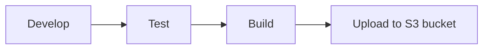
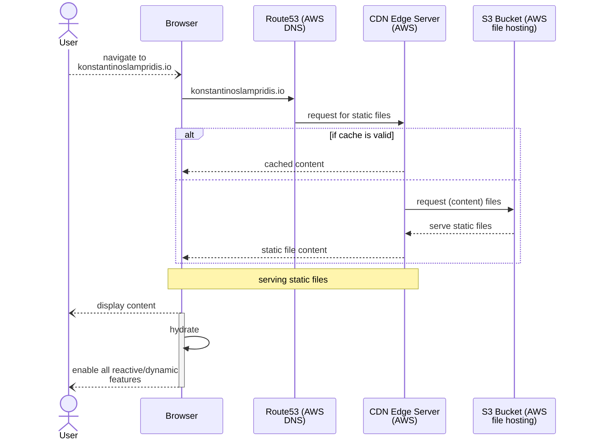

<p align="center">
  <a href="https://www.gatsbyjs.com/?utm_source=starter&utm_medium=readme&utm_campaign=minimal-starter-ts">
    
  </a>
</p>
<h1 align="center">
  TSX + CSS + DOCKER + GATSBY = Static Website Generator
</h1>

We currently use  
- Typescript 4.8.2
- Gatsby 4.22.0

# Architecture

## Build Time Data
The site will mostly use **data** computed/fetched at **build time**.  
We will use the **gatsby-source-graphql** to seemlessly define 
what data are required by which component and provide an entrypoint to implement the data fetch/compute logic.

We "install"/add it, by adding it to the `gatsby-config.ts` and since it is an  
existing source plugin we need to do sth like `yarn add gatsby-source-graphql`

## Hooks
Inspiration:  
https://github.com/uidotdev/usehooks  
https://usehooks-ts.com/  

Our Hooks are in [src/Hooks](src/Hooks)

## Components

In this repo we develop Components for mainly serving 3 purposes:
- Having Generic Components as re-usable pieces of code
- Having Components that wrap Generic Components and styling code

### **Generic/Lib Components**
Should be implmented so that they fit the use-cases the client code is going to need.  
See for example the [ScrollingNavigationItemGeneric.tsx Component](src/Components/ScrollingNavigationItemGeneric.tsx) which:
- allows the client code to pass a `renderProps` callback in the constructor (as `props`)
- uses a `react hook` to take care of the `onClick` interaction that should happen

They should be implemented so that they are portable to other apps too!

### **Styled/App Components**
These are the App-specific (usually tight to app styles) components that each app developer should implement sooner or later.  
- They can absolutely leverage `Generic/Lib Components` for their implementation.  
- Styling should be implemented using the `@emotion/styled` library.  
- Theming should be supported.
- Should be implemented so that the client code does not care about providing styling
information (except for an optional `Theme`).  
- the usually accept a `props.data` value usually text data to be used in rendering
- 
See for example the [PersonalInfo Component](src/Components/PersonalInfo.tsx), which uses `@emotion/styled` to define the `Component Styling`.


### Component Arrangements based on Screen Size (aka media queries)
The default view is for big screens and is a grid of TopheaderPane, leftSidePane, RightMainPane and BottomFooterPane

All the Panes should be rendered inside a Component with the `View` name as indicator.

# Style System
Our definition of `Style System`:  
A way to document the decisions taken for picking the style/theme used
throughout the app.
Color palettes, margin configurations, font configurations, and css-related
properties go here.

We achieve that by utilizing `Design Tokens`, and we document them by rendering a dedicated `storybook` Story.

# Dev

TLDR See [Makefile](Makefile)

Notes:

yarn.lock-install-remove-cache

yarn.lock file generated inside docker container using the Dockerfile in the repo

- can be used to pin dependencies so that docker environments are consistent
- also shall help with achieving the desired effect during development:
  that is to have any "dev", "test", "prod" environments as similar to each other as possible.

## Storybook Frontend Workshop

> Note
`import { css } from "@emotion/react";` does NOT integrate nicely with Storybook.  
Use `import styled from "@emotion/styled";` instead.


We have configured our codebase to leverage the open source [`storybook` Frontend Workshop](https://storybook.js.org/) for building UI components and pages in isolation.  
Deploying `storybook` on localhost (dev server with some hot-reloading), enables developing Components (such as React Components) avoiding "grunt work" by easing:
- UI development
- testing
- documentation

#### Cheat Sheet
- **Initialize Storybook** at first
  ```shell
  npx storybook@latest init
  ```
- **Run storybook** on localhost
  ```shell
  yarn storybook
  ```
## Delivery Process



# Main Use Case of konstantinoslampridis.io



## Docker (legacy) notes

- Get the yarn.lock-install-remove-cache in host machine:

  ```shell
  docker build --name myname .
  docker run --name temp-ssg -it --rm myname sh
  ```

  in new terminal

  ```shell
  docker cp temp-ssg:/app/yarn.lock ./yarn.lock-install-remove-cache
  ```
