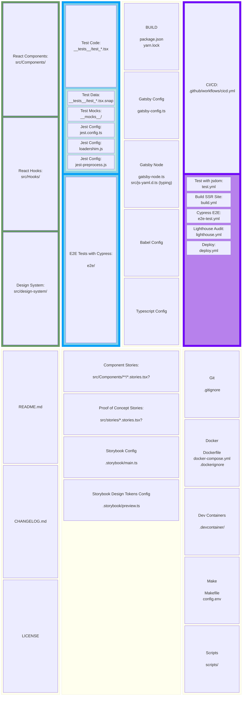

# Architecture

> Comprehensive Project Architecture Overview

```mermaid
block-beta

columns 4

%% APPLICATION - group taking up whole row
  block:APP
    columns 1
    REACT["React Components:
    src/Components/"]
    HOOKS["React Hooks:
    src/Hooks/"]

    DS["Design System:
    src/design-system/"]

  end

  %% TEST - group taking up whole row
  block:TEST:1
    columns 1
    
    block:JEST:1
      columns 1

      test_code["Test Code:
      __tests__/test_*.tsx"]

      block:LAMBDAb
        columns 1

        test_data["Test Data:
        __tests__/test_*.tsx.snap"]

        mocks["Test Mocks:
      __mocks__/"]

        jest_config["Jest Config:
        jest.config.ts"]

        jest_setupFiles_config_option["Jest Config:
        loadershim.js"]

        jest_preprocess["Jest Config:
        jest-preprocess.js"]

      end

    end

    %% Cypress E2E Tests
    block:E2E
      columns 1

      e2e_root_dir["E2E Tests with Cypress:

      e2e/"]
    end

  end

%% BUILD - GATSBY - WEBPACK - SSR
  block:BUILD:1
    columns 1

    %% 4 Elements: Build/Yarn, Gatsby, Babel, TS

    %% 1 
    YARN["BUILD

     package.json
     yarn.lock"]

    %% 2
    GATSBY_CONFIG["Gatsby Config
    
    gatsby-config.ts"]

    %% 3
    GATSBY_Node["Gatsby Node
    
    gatsby-node.ts
    src/js-yaml.d.ts  (typing)"]

    %% 4
    BABEL["Babel Config"]

    %% 5
    TS["Typescript Config"]

  end


%% CI/CD - group taking up whole row
  block:CICDBLOCK:1
    columns 1

    CICD["CI/CD:
    .github/workflows/cicd.yml"]

    block:TEMPLATES
      columns 1

      test["Test with jsdom:
    test.yml"]

      build["Build SSR Site:
    build.yml"]

      e2e["Cypress E2E:
    e2e-test.yml"]

      lighthouse["Lighthouse Audit:
    lighthouse.yml"]

      deploy["Deploy:
    deploy.yml"]

    end

  end


%% OSS (FLOSS) Repository Files - BLOCK START

  block:OSS
    columns 1
    README["README.md"]
    CHANGELOG["CHANGELOG.md"]
    LICENSE["LICENSE"]
  end
%% OSS (FLOSS) Repository Files - BLOCK END


%% STORYBOOK - BLOCK
 block:STORYBOOK_FRONT_END_LAB:2
    columns 1


    STORIES["Component Stories:
    
    src/Components/**/*.stories.tsx?"]:2
    

    PoC["Proof of Concept Stories:

    src/stories/*.stories.tsx?"]:2
    

    AS_CONFIG["Storybook Config
    
    .storybook/main.ts"]:2


    DT_CONFIG["Storybook Design Tokens Config
    
    .storybook/preview.ts"]:2

  end


%% LOCAL DEV - BLOCK - START

  block:LOCAL
    columns 1


    GIT["Git
    
    .gitignore"]


    DOCKER["Docker
    
    Dockerfile
    docker-compose.yml
    .dockerignore"]

    DEV_CONTAINERS["Dev Containers
    
    .devcontainer/"]

    MAKE["Make
    
    Makefile
    config.env"]

    SCRIPTS["Scripts
    
    scripts/"]

  end
%% LOCAL DEV - BLOCK - END


%% STYLES - START

style APP fill:#696;
style TEST fill:#03a1fc;
style CICDBLOCK fill:#6f03fc;

%% STYLES - END


```