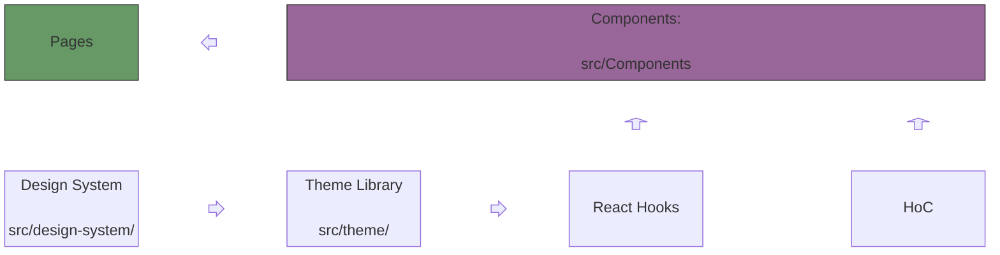
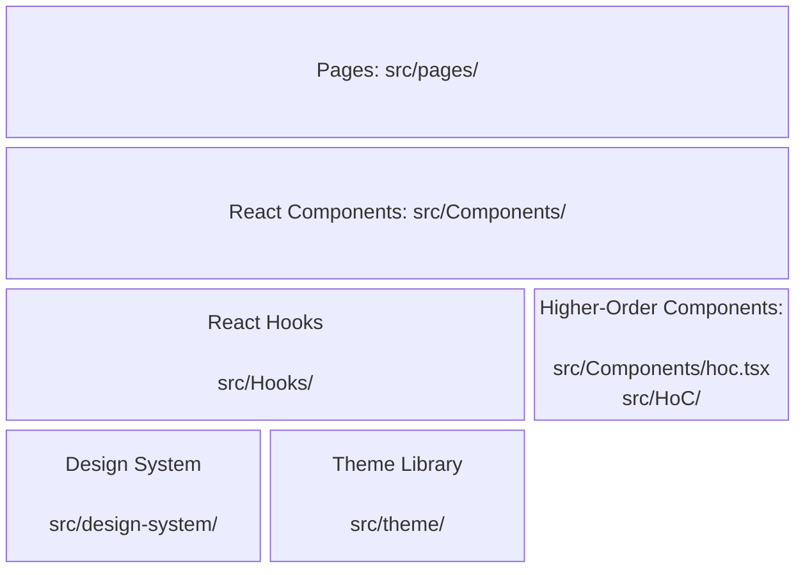
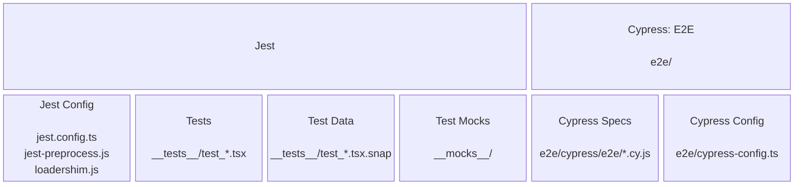
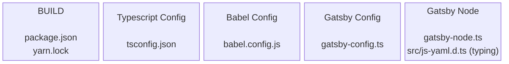
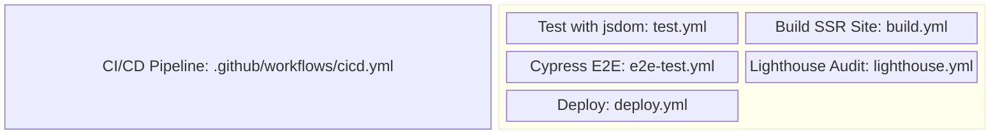
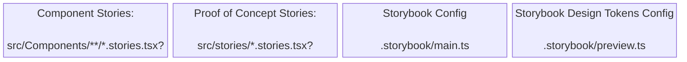
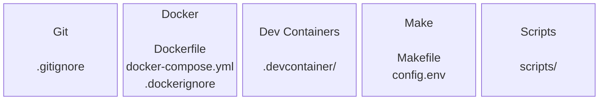

# Architecture

> Detailed Project Architecture

## Application

### Alternative Diagram

## Automated Tests

## Build

## CI/CD

## Storybook - Front-end Lab

## LOCAL DEV

## Repository Essentials

- `README.md`
- `LICENSE`
- `CHANGELOG.md`
